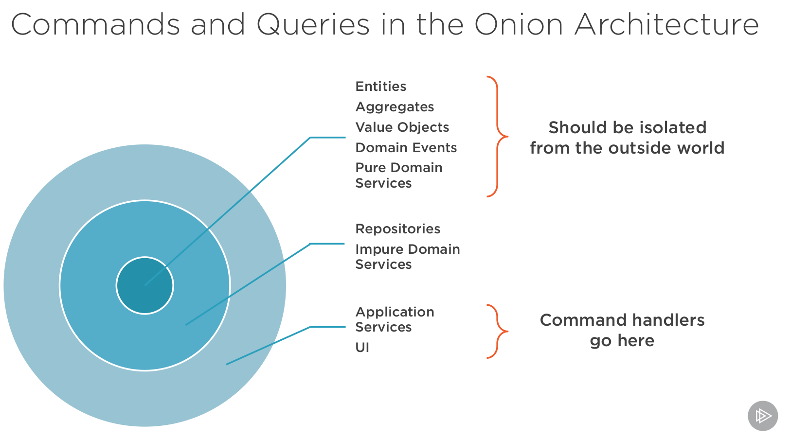

# 5 Segregating Commands and Queries

## Introducing a First Command

**Command** should ony containing what should be done, not the execution.
This is done by a **Handler**


```C#

    public interface ICommand
    {
    }

    public interface ICommandHandler<TCommand>
        where TCommand : ICommand
    {
        Result Handle(TCommand command);
    }


    public sealed class EditPersonalInfoCommand : ICommand
    {
        public long Id { get; }
        public string Name { get; }
        public string Email { get; }

        public EditPersonalInfoCommand(long id, string name, string email)
        {
            Id = id;
            Name = name;
            Email = email;
        }

        [AuditLog]
        [DatabaseRetry]
        internal sealed class EditPersonalInfoCommandHandler : ICommandHandler<EditPersonalInfoCommand>
        {
            private readonly SessionFactory _sessionFactory;

            public EditPersonalInfoCommandHandler(SessionFactory sessionFactory)
            {
                _sessionFactory = sessionFactory;
            }

            public Result Handle(EditPersonalInfoCommand command)
            {
                var unitOfWork = new UnitOfWork(_sessionFactory);
                var repository = new StudentRepository(unitOfWork);
                Student student = repository.GetById(command.Id);

                if (student == null)
                    return Result.Fail($"No student found for Id {command.Id}");

                student.Name = command.Name;
                student.Email = command.Email;

                unitOfWork.Commit();

                return Result.Ok();
            }
        }
    }


    //Marker Interface


```

## Commands in CQS vs. Commands in CQRS

CQS Command is a Controller Method
CQRS Command is a own Class/Explicit Representation what has to be done

## Commands and Queries in CQRS

**Messages:**

* Commands: Imperative Tense i.e. Edit PersonalInfoCommand
* Queries: Start With "Get" i.e. GetListQuery
* Events: PastTense i.e. PersonalInfoChangedEvent

**Commands should use the Ubiquitous Language**

## Commands and Queries in the Onion Architecture

All Messages are Part of the domain layer,
Handler Application Layer



## Commands vs. DTO's

**map dto to command !**

DTO's: Data contracts => Backward compatibility
commands: Serializable method calls

## Leveraging ASP.NET Core Dependency Injection to Resolve Handlers

```C#

    Done by Mediator

  public sealed class Messages
    {
        private readonly IServiceProvider _provider;

        public Messages(IServiceProvider provider)
        {
            _provider = provider;
        }

        public Result Dispatch(ICommand command)
        {
            Type type = typeof(ICommandHandler<>);
            Type[] typeArgs = { command.GetType() };
            Type handlerType = type.MakeGenericType(typeArgs);

            dynamic handler = _provider.GetService(handlerType);
            Result result = handler.Handle((dynamic)command);

            return result;
        }

        public T Dispatch<T>(IQuery<T> query)
        {
            Type type = typeof(IQueryHandler<,>);
            Type[] typeArgs = { query.GetType(), typeof(T) };
            Type handlerType = type.MakeGenericType(typeArgs);

            dynamic handler = _provider.GetService(handlerType);
            T result = handler.Handle((dynamic)query);

            return result;
        }
    }    
```

## Introducing a Query

```C#
    public interface IQuery<TResult>
    {
    }

    public interface IQueryHandler<TQuery, TResult>
        where TQuery : IQuery<TResult>
    {
        TResult Handle(TQuery query);
    }

        public sealed class GetListQuery : IQuery<List<StudentDto>>
    {
        public string EnrolledIn { get; }
        public int? NumberOfCourses { get; }

        public GetListQuery(string enrolledIn, int? numberOfCourses)
        {
            EnrolledIn = enrolledIn;
            NumberOfCourses = numberOfCourses;
        }

        internal sealed class GetListQueryHandler : IQueryHandler<GetListQuery, List<StudentDto>>
        {
            private readonly QueriesConnectionString _connectionString;

            public GetListQueryHandler(QueriesConnectionString connectionString)
            {
                _connectionString = connectionString;
            }

            public List<StudentDto> Handle(GetListQuery query)
            {
                string sql = @"
                    SELECT s.StudentID Id, s.Name, s.Email,
	                    s.FirstCourseName Course1, s.FirstCourseCredits Course1Credits, s.FirstCourseGrade Course1Grade,
	                    s.SecondCourseName Course2, s.SecondCourseCredits Course2Credits, s.SecondCourseGrade Course2Grade
                    FROM dbo.Student s
                    WHERE (s.FirstCourseName = @Course
		                    OR s.SecondCourseName = @Course
		                    OR @Course IS NULL)
                        AND (s.NumberOfEnrollments = @Number
                            OR @Number IS NULL)
                    ORDER BY s.StudentID ASC";

                using (SqlConnection connection = new SqlConnection(_connectionString.Value))
                {
                    List<StudentDto> students = connection
                        .Query<StudentDto>(sql, new
                        {
                            Course = query.EnrolledIn,
                            Number = query.NumberOfCourses
                        })
                        .ToList();

                    return students;
                }
            }
        }
    }

```

# Summary

Very slim controllers !


