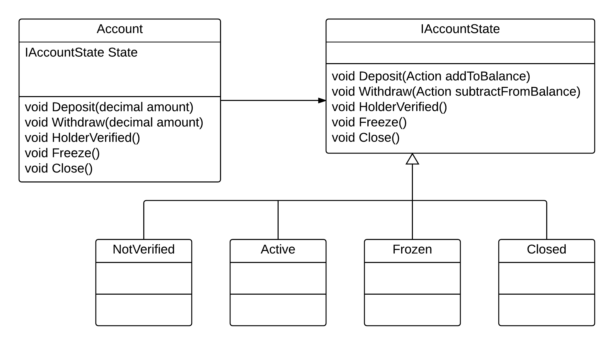

# 3 Rendering Branching Over Boolean Tests Obsolete

## Recognizing the Problem

=> growing complexity with branching, double of unit tests for every feature

## Turning Branching into a Function

guard or full if-than-else

Use an Action inside the Class to use different behavior

## Turning Function into a State

Type of the State object Replace Branching
Dynamic dispatch used to chose 

``` C#

    interface IAccountState
    {

        //Use Call Backs for Operation flow
        IAccountState Deposit(Action addToBalance);
        IAccountState Withdraw(Action subtractFromBalance);

        IAccountState Freeze();
        IAccountState HolderVerified();
        IAccountState Close();
    }

    class Active : IAccountState
    {
        private Action OnUnfreeze { get; }

        public Active(Action onUnfreeze)
        {
            this.OnUnfreeze = onUnfreeze;
        }


        public IAccountState Deposit(Action addToBalance)
        {
            addToBalance();
            return this;
        }

        public IAccountState Withdraw(Action subtractFromBalance)
        {
            subtractFromBalance();
            return this;
        }

        public IAccountState Freeze() => new Frozen(this.OnUnfreeze);
        public IAccountState HolderVerified() => this;
        public IAccountState Close() => new Closed();
    }


    class Account
    {
        public decimal Balance { get; private set; }

        private IAccountState State { get; set; }

        public Account(Action onUnfreeze)
        {
            this.State = new NotVerified(onUnfreeze);
        }

        // #1 (Interaction): Deposit was invoked on the State
        // #2 (Behavior): Result of State.Deposit is new State
        // #5 (Behavior): Deposit 10, Deposit 1 - Balance == 11
        public void Deposit(decimal amount)
        {
            this.State = this.State.Deposit(() => { this.Balance += amount; });
        }

        // #3 (Interaction): Withdraw was invoked on the State
        // #4 (Behavior): Result of State.Withdraw is new State
        // #6 (Behavior): Deposit 1, Verify, Withdraw 1 - Balance == 9
        public void Withdraw(decimal amount)
        {
            this.State = this.State.Withdraw(() => { this.Balance -= amount; });
        }

        public void HolderVerified()
        {
            this.State = this.State.HolderVerified();
        }

        public void Close()
        {
            this.State = this.State.Close();
        }

        public void Freeze()
        {
            this.State = this.State.Freeze();
        }

    }
```

## Assessing Improvement




    